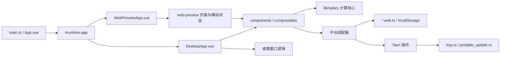

# PayDance 技术文档

> [English version →](DEVELOPMENT_EN.md)

面向开发者与维护者，覆盖环境、架构、验证、发布与维护约定。用户说明见 [README](../README.md) 和[常见问题](FAQ.md)，提交流程见[贡献指南](../.github/CONTRIBUTING.md)。

## 环境

- Windows 11 是桌面版的发布与验证基线。
- Node.js 24、Rust stable、npm。桌面开发另需 [Tauri Windows 前置依赖](https://v2.tauri.app/zh-cn/start/prerequisites/)：Microsoft C++ 生成工具和 WebView2。

```powershell
npm ci
npm run tauri dev   # 桌面版
npm run dev:web     # Web Preview
npm run build:exe   # Windows 便携版
npm run build:web   # 网页版
```

`build:desktop` 与 `build:web` 共用 `dist/`，不要并行运行。

重置本地配置、重新进入首次向导：

```powershell
Remove-Item "$env:APPDATA\com.masterbao.paydance\salary-settings.json"
```

## 架构



| 位置 | 职责 |
|---|---|
| `src/App.vue` | 通过 Vite 别名 `#runtime-app` 选择桌面端或 Web Preview 入口 |
| `src/lib/salary/` | 纯工资计算核心；`src/lib/salary.ts` 只导出公共接口 |
| `src/composables/` | 设置、计时、主题和窗口等应用行为；桌面窗口 composable 可依赖 Tauri |
| `src/components/` | 主看板、设置、首次向导、迷你窗口等界面组件 |
| `src/web-preview/` | 官网页面、浏览器内交互模拟和分区样式 |
| `src/platform/` | 设置存储、链接打开和更新检查的目标适配器；Web 构建选用 `*.web.ts` |
| `src-tauri/src/tray.rs` | 托盘、单实例唤起和主窗口销毁处理 |
| `src-tauri/src/portable_update.rs` | Windows 便携版更新；`src-tauri/src/lib.rs` 只装配插件、命令和启动模块 |

数据流：

1. Vite 根据构建模式选择运行入口和平台适配器。
2. `useSalarySettings.ts` 从 Tauri Store 或 `localStorage` 读取设置。
3. `settings-migration.ts` 修复薪资配置，`window-mode.ts` 归一化窗口偏好。
4. `useSalaryTicker.ts` 用混合单调时钟生成当前时间，调用 `src/lib/salary/` 计算收入、进度和下一次状态变化。
5. `useDashboardModel.ts` 把计算结果转换为界面状态和文案。
6. 桌面端的窗口、托盘、自启动和更新由 composable、平台适配器与 Rust 分层处理，不进入工资计算核心。

### 修改导航

| 修改内容 | 主要位置 | 最低验证 |
|---|---|---|
| 工资规则、午休、夜班 | `src/lib/salary/` | `npm test -- src/lib/salary` |
| 薪资设置或迁移 | `src/lib/settings-migration.ts`、`src/lib/settings-store.ts`、`src/composables/useSalarySettings.ts` | `npm test -- src/lib/settings-migration.test.ts src/composables/useSalarySettings.test.ts` |
| 窗口尺寸、位置或迷你模式 | `src/lib/window-mode.ts`、`src/composables/useWindow*.ts` | `npm test -- src/lib/window-mode.test.ts src/composables/useWindowMode.test.ts src/composables/useWindowPositionRecovery.test.ts` |
| 主窗口、设置或首次向导 | `src/components/`、`src/styles/`、`src/DesktopApp.vue` | `npm test`、`npm run build:desktop` |
| 界面文案与翻译 | `src/i18n/types.ts`、`src/i18n/locales/zh-CN.ts`、`src/i18n/locales/en.ts` | `npm run build:desktop`（缺键由 `vue-tsc` 报出） |
| Web Preview 页面、路由或样式 | `src/web-preview/`、`src/WebPreviewApp.vue`、`index.html`、`en/index.html` | `npm run build:web`、`npm run qa:web-preview` |
| 托盘、单实例或 Rust 窗口事件 | `src-tauri/src/tray.rs`、`src-tauri/src/lib.rs` | `cargo test --manifest-path src-tauri/Cargo.toml`、相关 Vitest |
| 自启动 | `src/lib/autostart.ts`、`src/composables/useAutostart.ts` | `npm test -- autostart` |
| 便携版更新与发布 | `src/platform/updater.ts`、`src-tauri/src/portable_update.rs`、`.github/workflows/release.yml` | `npm run verify:release` |
| 依赖或工作流元数据 | `package.json`、`src-tauri/Cargo.toml`、`.github/` | `npm run verify:metadata` |

### 必须保持的边界

- 工资计算不得读取存储、窗口或 Tauri API。
- 目标差异只通过 Vite 别名和平台适配器隔离；Web 构建不得包含桌面入口或 Tauri 运行代码。
- `src/web-preview/web-preview.css` 的分区导入顺序影响层叠结果，调整后必须运行 Web Preview QA。
- 托盘和便携版更新留在独立 Rust 模块，不回填到 `src-tauri/src/lib.rs`。
- `src/architecture-size.test.ts` 锁定 `OnboardingPanel.vue`、`SettingsPanel.vue`、`src/lib/salary.ts`、`web-preview.css` 和 `lib.rs` 的行数上限；新增逻辑拆到子模块。

## 设计规范

适用于主界面、迷你悬浮、设置中心、首次向导和 Web Preview。

- 遵循 Windows 11 桌面工具的简洁层次，减少装饰和视觉噪声；今日入账金额始终是第一视觉焦点。
- 信息层级依次为：今日入账金额；当前状态、已工作时间、距离上下班、今日预计；今日进度；薪资说明、设置和托盘等低频入口。主界面只保留金额层和看板层，不叠加独立卡片、徽章或说明层。
- 橙色仅用于收入、进度、焦点和必要反馈，不作大面积背景色。

窗口：

- 主窗口无边框大圆角，不启用原生阴影；顶部状态区和窗口按钮保留足够内边距。
- 设置中心和薪资说明打开后，背景空白处及弹层标题栏仍可拖动窗口。
- 首次向导使用较高不透明度，避免主界面内容干扰阅读。
- 迷你窗口只显示金额；右键打开轻量透明度面板，面板与迷你窗口对齐，打开时不改变迷你窗口位置。
- Web Preview 在浏览器舞台中呈现应用窗口，页面背景不与主界面争夺注意力；隐藏托盘、置顶和开机自启动等桌面能力，迷你窗口和透明度可在浏览器内模拟。

主题与字体：

- 浅色主题使用白色层级、浅边框和低强度阴影；深色主题使用清晰的近黑层级，避免泛白高光和凹槽效果。
- 进度条平面清晰；进度圆点可有轻微光感，不使用扩散发光。
- 主题切换必须同步页面与原生窗口主题，避免边框、四角或背景短暂错色。
- 主金额与迷你金额使用 `--font-mono` 并开启 `tabular-nums`；看板数字使用 `--font-dashboard`；设置、薪资说明和首次向导中的数字、英文及符号沿用同一字体变量，不在局部组件另设数字字体。
- `h`、`m`、货币符号与数字之间保留清晰间距；金额以整数为主，小数降低视觉权重。

动效与组件：

- 金额变化可用短促、克制的脉冲，不加持续环境光或大面积呼吸光；金额滚动与静态显示由用户设置控制。
- 保留键盘焦点可见性，遵循系统的减少动态效果偏好。
- 设置按任务分组，不压缩成连续密集表单；薪资说明只展示日薪、时薪、分薪和秒薪，不承载设置操作。
- GitHub 入口保持可识别的按钮形态，但不占满设置面板宽度。

验收：同时检查浅色、深色、中文和英文，确保文字不重叠、控件不溢出、焦点状态可见。桌面改动覆盖受影响组件的行为测试，并按[发布前冒烟清单](#发布前冒烟清单)检查真实窗口能力；Web Preview 改动运行 [Web Preview QA](#web-preview-qa)，确认视觉变化符合预期后才更新基准图。

## 验证

按改动范围运行：

```powershell
npm run verify:metadata   # 文档、法务、品牌和社区模板
npm run verify:fast       # 前端或桌面代码
npm run qa:web-preview    # Web Preview 行为或样式
```

Rust 改动在 `src-tauri/` 运行：

```powershell
cargo fmt --all -- --check
cargo check
cargo clippy --all-targets -- -D warnings
cargo test
```

依赖或安全相关改动再运行 `npm audit --audit-level=high`；Rust 依赖改动加 `cargo audit` 和 `cargo deny check`。

### CI 覆盖边界

`scripts/ci-change-scope.mjs` 按改动文件决定跑哪些 job，`CI gate` 与 `CodeQL gate` 只校验本次判定为必需的 job。绿灯不等于全量检查跑过：

- 纯文档改动只跑 metadata job，前端、Rust、Web Preview QA、安全审计和 CodeQL 全部跳过。
- `scripts/` 下的改动触发完整 CI，但 Vitest 属于前端 job，只在前端文件变化时运行；改完脚本要在本地自己跑 `npm test`。

### Web Preview QA

Web Preview QA 用来确认官网橱窗的内容、布局、主题、语言、无障碍和视觉基准。`npm run qa:web-preview` 启动本地 Vite 服务，用 Playwright Chromium 遍历中英文、浅深色和 `1440x900` / `960x760` / `390x844` 三种视口的全部 12 个组合，结束时关闭服务。每个组合检查：

- 页面标题、Canonical、`zh-CN` / `en` / `x-default` `hreflang` 和 JSON-LD。
- 版本、语言状态、核心文案、下载入口、软件预览区和功能说明。
- 关键元素是否越界、重叠、换行异常或垂直错位。
- 首次主题绘制是否稳定，连续切换主题时预览窗口边缘是否一致。
- `@axe-core/playwright` 报告的 critical 或 serious 无障碍问题。
- 浏览器控制台错误和页面错误；任一错误都会使验证失败。

组合之外还会验证一次移动端从中文 `/PayDance/` 到英文 `/PayDance/en/` 的真实导航。本地和 GitHub Pages 镜像从 `/PayDance/` 进入中文页、从 `/PayDance/en/` 进入英文页，Vercel 主站对应 `/` 和 `/en/`；该命令只访问本地服务，不验证已部署的站点。不要用 headless Chrome、CDP 或命令行截图代替本流程：脚本同样跑在 headless Chromium 上，但会执行 DOM、交互、无障碍、控制台和像素差异断言。

首次运行先安装 Chromium：`npx playwright install chromium`。脚本优先加载项目 `node_modules` 中的 Playwright，仅在排查外部运行环境时才用 `PLAYWRIGHT_NODE_MODULES` 指定另一套。默认端口 4174 被占用时，用 `$env:PAYDANCE_WEB_QA_PORT` 临时指定其他端口。

像素差异覆盖中文浅色和英文深色各自的桌面端与移动端四个状态，忽略轻微抗锯齿差异，变化像素超过 `0.5%` 即失败。基准图在 `tests/visual-baselines/`，确认视觉变化符合预期后运行 `npm run qa:web-preview:update` 更新，并随改动一起提交。

截图保存在系统临时目录（Windows 通常是 `%LOCALAPPDATA%\Temp`，CI 是 `RUNNER_TEMP`）下的 `paydance-web-preview-qa-{version}-{commit}-{timestamp}`；同目录的 `summary.json` 记录版本、Commit、本地 URL、页面实际读取到的中英文文案、截图路径和视觉比较结果。退出码为 0 即通过；任一断言失败都会打印原因和出错的检查项，视觉比较失败时直接给出预期图、实际图和差异图的路径。

### 本地工具链对齐

- CI 的 Rust 用 `stable`，本地落后会让 `cargo clippy -D warnings` 的结论与 CI 不一致：`rustup check` 看差距，`rustup update stable` 跟上。
- `npm run verify:release` 调用本地的 cargo-audit 和 cargo-deny，版本必须与 CI 固定的一致，否则本地审计结论不作数：

```powershell
cargo install cargo-audit --version 0.22.2 --locked
cargo install cargo-deny --version 0.20.2 --locked
```

## 发布

### 流程

不设固定发版周期，积累到一组完整且验证充分的改动后再发布。

1. 更新版本号（`npm run version:check` 校验各处一致），并在 `CHANGELOG.md` 与 `CHANGELOG_EN.md` 中为该版本建立 `### vX.Y.Z` 小节；Release 正文从中文 CHANGELOG 生成。
2. 运行 `npm run verify:release`，完成 [Web Preview QA](#web-preview-qa) 和[发布前冒烟清单](#发布前冒烟清单)。
3. `npm run push:main` 推送到 `main`：它先在本地跑 `verify:metadata`，需要完整 CI 的改动再跑 lint 与单元测试，然后等待 GitHub 上的 CI、CodeQL 和 Web Preview 通过；存在未处理的 Dependabot 告警时拒绝推送。只做本地检查用 `npm run verify:push`。
4. `npm run release:publish` 打标签：它确认 CI 与 CodeQL 已在该提交通过、标签不存在，推送后等待 Release 与 Post-Release Smoke。
5. Release 发布后，用上一版 EXE 升级到新版本，完成冒烟清单的「便携版更新」一节。

`push:main` 与 `release:publish` 都需要已登录的 GitHub CLI（`gh auth login`）。

推送策略：文案、图片、README 和低风险文档可直接推 `main`；功能、Bug 修复、依赖升级、发布流程和安全相关修改走 PR，等待 CI 与 CodeQL 通过。

### 发布链路约束

- `latest.json` 必须指向对应版本的 Windows EXE；`.sha256` 必须匹配实际 EXE。
- `.sig` 是 Tauri updater 签名，不是 Windows Authenticode 发布者签名；接入 Authenticode 前先确认成本、证书来源、续期方式和失败回滚路径。
- `release-assets/pay-dance-sbom.spdx.json` 随 Release 归档。
- GitHub Actions 的 `uses:` 固定到 40 位 Commit SHA，行尾保留版本注释；安全工具下载全部校验 SHA256。
- CodeQL workflow 显式分析 `javascript-typescript` 与 `rust`。
- Release workflow 运行 `scripts/smoke-windows-exe.ps1`，生成的 `paydance-exe-smoke-report.json` 只覆盖主窗口、持续运行、响应状态和单实例，不替代人工清单。

### 发布前冒烟清单

开始前记录 PayDance 版本、Commit、Windows 版本、显示器配置和 DPI 缩放；首次启动项使用未运行过 PayDance 的测试账户或虚拟机。记录每个失败项、截图、复现步骤和是否阻塞发布。

启动与持久化：

- [ ] 双击 EXE 后只出现一个主窗口；没有保存位置时窗口居中且完全可见。
- [ ] 首次启动显示三步向导，偏好、薪资和工作时间均可完成。
- [ ] 完成向导后，今日入账、当前状态、已工作时间、今日预计和进度正常显示。
- [ ] 通过托盘菜单退出后重新启动，首次向导不再出现，设置和窗口状态保持一致。
- [ ] 使用上一版本生成的设置启动时，应用正常进入主界面，已有有效设置仍然生效。

设置：

- [ ] 修改薪资模式、金额、工作日、上下班时间和午休设置后，主看板立即更新。
- [ ] 修改或清空货币符号后，设置预览、主看板、今日预计、薪资说明和迷你窗口同步更新；重启后保持。
- [ ] 修改主题、金额显示方式和置顶状态后，界面立即更新；重启后保持。
- [ ] 输入无效薪资配置时显示明确提示，不覆盖最后一次有效薪资配置；主题、语言和窗口偏好仍可保存。
- [ ] 切换中英文后，主界面、设置和校验提示同步切换；重启后保持。
- [ ] 开启开机自启动并重启 Windows 后，PayDance 自动启动；关闭后不再注册自启动。

托盘与单实例：

- [ ] 最小化主窗口后托盘图标仍存在；点击托盘图标可恢复并聚焦窗口。
- [ ] 点击标题栏关闭按钮、按 `Alt+F4` 或使用任务栏「关闭窗口」后，主窗口隐藏到托盘，进程继续运行。
- [ ] 托盘菜单可以打开主界面、打开设置、切换迷你模式、切换置顶和退出。
- [ ] 切换到 English 后，托盘菜单和悬停提示立即变为英文；重启后仍为英文。
- [ ] 应用运行时再次启动同一 EXE，不创建第二个主窗口；已有窗口恢复并聚焦。
- [ ] 从托盘选择「退出」后，托盘图标消失，进程结束，任务管理器中没有残留。

迷你悬浮：

- [ ] 双击主金额，或聚焦金额后按 `Enter` / `Space`，进入迷你模式。
- [ ] 迷你窗口可拖动并始终置顶；双击或按 `Enter` / `Space` 可恢复主窗口。
- [ ] 迷你模式不显示任务栏按钮，恢复主窗口后任务栏按钮重新出现。
- [ ] 迷你模式下按 `Alt+F4` 隐藏窗口，再点击托盘图标恢复，任务栏按钮仍不出现。
- [ ] 右键迷你窗口可打开透明度面板；面板与迷你窗口对齐，失焦或按 `Esc` 后关闭。
- [ ] 调整透明度后立即生效，重启后保持；中文、英文和深浅主题均与主窗口一致。

桌面环境：

- [ ] 切换深浅主题时，窗口四角、边框和主面板没有明显闪白、错色或残影。
- [ ] 系统休眠后恢复，今日入账不倒退；休眠期间落在工作时段的部分照常计入，恢复瞬间金额向前跳一段属于预期。
- [ ] 在多显示器之间移动主窗口和迷你窗口后重启，两个窗口都回到关闭前所在的显示器，尺寸和位置与关闭前一致（贴边摆放时略微内移以保证完整可见）。
- [ ] 将窗口移到副屏并断开副屏后重新启动，窗口回到主屏可见区域。
- [ ] 在 100%、150% 和 200% 缩放下，主窗口、设置、首次向导、迷你窗口和透明度面板没有文字重叠或控件截断。

便携版更新（Release 发布后用上一版 EXE 升级验证；未验证时在记录中说明原因）：

- [ ] 上一版检测到新版本后，在设置底部版本号旁显示更新按钮。
- [ ] 点击更新后完成下载，旧进程退出，同一路径下的 EXE 被替换并自动重新启动。
- [ ] 更新后的版本号正确，原有设置、窗口状态和首次启动完成状态保持不变。
- [ ] 更新失败时显示可重试的错误，当前 EXE 仍可正常启动。

## 维护约定

### 配置迁移

- `src/lib/settings-migration.ts` 的 `settingsSchemaVersion` 记录薪资配置结构版本。窗口尺寸、迷你模式和透明度的兼容边界在 `src/lib/window-mode.ts`，其 `windowSettingsSchemaVersion` 与写盘的 `settingsVersion` 是两个计数器，上调前者会重置所有用户的窗口尺寸。
- 新增持久化字段先补迁移测试，再改迁移逻辑；改 schema 时同步检查 `src/composables/useSalarySettings.ts` 的读写键和保存校验。
- 旧配置不能阻塞启动。时间、布尔值、薪资数字和工作日在使用前归一化，无法识别或不安全的值回退默认值，未知字段不透传到运行时配置。
- 自动恢复只重置损坏项或最小关联组，保留其他有效设置并立即写回；已完成的后台修复不长期展示为警告。

### 诊断与日志

- 用户能看到的错误说明下一步该怎么做：重试、检查配置或重新打开应用。
- 维护者诊断信息留在 console 或本地日志，只记录失败阶段和安全的错误类别，不写入薪资、私有路径、密钥、邮箱等敏感数据。

### 依赖更新

- Dependabot 负责依赖更新，配置在 `.github/dependabot.yml`：npm、cargo、github-actions 各一个 catch-all group，每周一 09:00（Asia/Shanghai）检查，不开自动合并。机器人自己开的升级 PR 在 DCO 门禁里有收紧的豁免，见 `scripts/check-dco.mjs`。
- 故意不升的依赖写在两处并保持同步：`dependabot.yml` 的 `ignore`，以及 `scripts/repository-metadata.test.js` 里 "keeps the upgrades that are blocked upstream pinned with a reason"。当前两条：`typescript` 锁在 6.x，TS 7 是原生移植版，vue-tsc 解析不到 `tsc.js`，typescript-eslint 拒绝加载；`@types/node` 锁在 24.x，跟随运行时主版本。
- 2026-10 待办：Node 26 转为 LTS 后，把 CI 各处 `node-version` 推到 26，同步放开 `@types/node` 的 major 封锁并删掉对应测试断言。
- 声明区间只是文档，真正决定安装结果的是提交进仓库的 `package-lock.json`。调整 `^` 下限时以锁定并验证过的版本为准，`@tauri-apps/*` 尤其要跟上：它们与 Rust 侧 crate 配套，下限过旧会让人误以为老 IPC 接口仍在支持范围内。

## 治理

- 项目由 Mr.Baoboer（GitHub：[MrBaoboer](https://github.com/MrBaoboer)）单人维护，对产品范围、合并、发布、安全、许可和商标拥有最终决定权。
- 决策依据：是否符合[产品边界](PRODUCT.md)；用户收益与 Windows 版本质量；验证结果、风险和维护成本；代码与素材的来源和许可是否清楚。超出范围、缺少验证、风险或维护成本不明确的 Issue 和 PR 可以关闭或暂缓。
- 处理顺序：按[安全策略](../.github/SECURITY.md)私下提交的安全问题；影响当前支持范围且可复现的 Bug；范围明确、完成验证并符合产品边界的 PR；功能建议和其他讨论。除安全策略约定的时限外，不承诺固定响应时间。
- 治理规则通过 PR 修改。授予新的仓库或发布权限前，先在本节写清职责、权限和交接方式。
