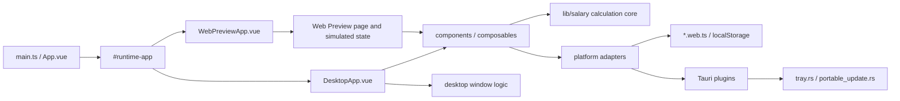

# PayDance Technical Guide

> [中文版 →](DEVELOPMENT.md)

For developers and maintainers: environment, architecture, verification, releases, and maintenance conventions. User-facing information lives in the [README](README_EN.md) and the [FAQ](FAQ_EN.md); the submission process is in the [Contributing Guide](CONTRIBUTING_EN.md).

## Environment

- Windows 11 is the release and validation baseline for the desktop app.
- Node.js 24, Rust stable, and npm. Desktop development also needs the [Tauri prerequisites for Windows](https://v2.tauri.app/start/prerequisites/): Microsoft C++ Build Tools and WebView2.

```powershell
npm ci
npm run tauri dev   # Desktop app
npm run dev:web     # Web Preview
npm run build:exe   # Windows portable EXE
npm run build:web   # Website build
```

`build:desktop` and `build:web` share `dist/`; do not run them in parallel.

Reset the local settings and reopen the first-run wizard:

```powershell
Remove-Item "$env:APPDATA\com.masterbao.paydance\salary-settings.json"
```

## Architecture



| Location | Responsibility |
|---|---|
| `src/App.vue` | Selects the desktop or Web Preview entry through the Vite `#runtime-app` alias |
| `src/lib/salary/` | Pure salary-calculation core; `src/lib/salary.ts` only exports the public API |
| `src/composables/` | Application behavior for settings, time, themes, and windows; desktop window composables may depend on Tauri |
| `src/components/` | Dashboard, settings, onboarding, mini window, and related UI |
| `src/web-preview/` | Website page, browser-side interaction simulation, and section styles |
| `src/platform/` | Target adapters for settings storage, external links, and update checks; web builds select the `*.web.ts` variants |
| `src-tauri/src/tray.rs` | Tray, single-instance wake-up, and main-window destruction |
| `src-tauri/src/portable_update.rs` | Windows portable updates; `src-tauri/src/lib.rs` only wires plugins, commands, and startup modules |

Data flow:

1. Vite selects the runtime entry and platform adapters from the build mode.
2. `useSalarySettings.ts` loads settings from Tauri Store or `localStorage`.
3. `settings-migration.ts` repairs salary settings; `window-mode.ts` normalizes window preferences.
4. `useSalaryTicker.ts` takes the current time from the hybrid monotonic clock and calls `src/lib/salary/` to compute earnings, progress, and the next state change.
5. `useDashboardModel.ts` turns the results into UI state and copy.
6. Desktop windows, tray, autostart, and updates stay in composables, platform adapters, and Rust; they never enter the salary core.

### Change Map

| Change | Primary location | Minimum validation |
|---|---|---|
| Salary rules, lunch break, or overnight shifts | `src/lib/salary/` | `npm test -- src/lib/salary` |
| Salary settings or migration | `src/lib/settings-migration.ts`, `src/lib/settings-store.ts`, `src/composables/useSalarySettings.ts` | `npm test -- src/lib/settings-migration.test.ts src/composables/useSalarySettings.test.ts` |
| Window size, position, or mini mode | `src/lib/window-mode.ts`, `src/composables/useWindow*.ts` | `npm test -- src/lib/window-mode.test.ts src/composables/useWindowMode.test.ts src/composables/useWindowPositionRecovery.test.ts` |
| Main window, settings, or onboarding | `src/components/`, `src/styles/`, `src/DesktopApp.vue` | `npm test`, `npm run build:desktop` |
| UI copy and translations | `src/i18n/types.ts`, `src/i18n/locales/zh-CN.ts`, `src/i18n/locales/en.ts` | `npm run build:desktop` (`vue-tsc` reports missing keys) |
| Web Preview page, routing, or styles | `src/web-preview/`, `src/WebPreviewApp.vue`, `index.html`, `en/index.html` | `npm run build:web`, `npm run qa:web-preview` |
| Tray, single instance, or Rust window events | `src-tauri/src/tray.rs`, `src-tauri/src/lib.rs` | `cargo test --manifest-path src-tauri/Cargo.toml`, the related Vitest files |
| Autostart | `src/lib/autostart.ts`, `src/composables/useAutostart.ts` | `npm test -- autostart` |
| Portable updates and releases | `src/platform/updater.ts`, `src-tauri/src/portable_update.rs`, `.github/workflows/release.yml` | `npm run verify:release` |
| Dependencies or workflow metadata | `package.json`, `src-tauri/Cargo.toml`, `.github/` | `npm run verify:metadata` |

### Required Boundaries

- Salary calculations must not read storage, windows, or Tauri APIs.
- Target differences are isolated only through Vite aliases and platform adapters; web builds must not contain the desktop entry or Tauri runtime code.
- The import order in `src/web-preview/web-preview.css` affects the cascade; run Web Preview QA after changing it.
- Tray and portable-update code stays in dedicated Rust modules, not in `src-tauri/src/lib.rs`.
- `src/architecture-size.test.ts` caps the line count of `OnboardingPanel.vue`, `SettingsPanel.vue`, `src/lib/salary.ts`, `web-preview.css`, and `lib.rs`; split new logic into submodules.

## Design Rules

These apply to the dashboard, mini window, settings, onboarding, and Web Preview.

- Follow the restrained hierarchy of a Windows 11 desktop tool and keep decoration and visual noise low; today's earnings amount is always the first focal point.
- Information hierarchy, in order: today's amount; current status, time worked, time to start or end, today's estimate; today's progress; low-frequency entries such as salary details, settings, and the tray. The dashboard keeps only the amount layer and the stats layer, with no extra cards, badges, or explanatory layers.
- Orange is reserved for earnings, progress, focus, and necessary feedback; never use it as a large background.

Windows:

- The main window is borderless with large rounded corners and no native shadow; the status area and window buttons keep generous padding.
- With settings or salary details open, the empty background and the sheet title bar still drag the window.
- Onboarding uses a high opacity so the dashboard behind it does not interfere with reading.
- The mini window shows only the amount; right-click opens a lightweight opacity panel aligned with the mini window, and opening it never moves the mini window.
- Web Preview presents the app window on a browser stage whose background does not compete with the dashboard; tray, always-on-top, and autostart are hidden, while the mini window and opacity can be simulated in the browser.

Themes and typography:

- Light mode uses white layers, light borders, and low-intensity shadows; dark mode uses clear near-black layers without washed-out highlights or inset grooves.
- The progress bar stays flat and crisp; the progress dot may carry a slight glow but never a diffuse bloom.
- Theme changes must switch the page and the native window together so borders, corners, and backgrounds never flash the wrong color.
- The main and mini amounts use `--font-mono` with `tabular-nums`; dashboard figures use `--font-dashboard`; digits, Latin text, and symbols in settings, salary details, and onboarding reuse the same font variables, with no component-local numeric font.
- Keep clear spacing between `h`, `m`, the currency symbol, and the digits; the integer part leads, and decimals carry less visual weight.

Motion and components:

- An amount change may use a short, restrained pulse, without persistent ambient light or large breathing glows; rolling versus static amounts is a user setting.
- Keep keyboard focus visible and honor the system reduce-motion preference.
- Settings are grouped by task rather than compressed into one dense form; salary details show only daily, hourly, per-minute, and per-second pay and carry no settings controls.
- The GitHub entry stays a recognizable button but does not span the full settings width.

Acceptance: check light, dark, Chinese, and English together, with no overlapping text, no overflowing controls, and visible focus states. Desktop changes cover the affected components with behavior tests and pass the [release smoke checklist](#release-smoke-checklist) for real window behavior; Web Preview changes run [Web Preview QA](#web-preview-qa) and update baselines only after confirming the visual change is intended.

## Verification

Run the checks that match the change:

```powershell
npm run verify:metadata   # Docs, legal, brand, and community templates
npm run verify:fast       # Frontend or desktop code
npm run qa:web-preview    # Web Preview behavior or styling
```

For Rust changes, run in `src-tauri/`:

```powershell
cargo fmt --all -- --check
cargo check
cargo clippy --all-targets -- -D warnings
cargo test
```

Dependency or security changes also run `npm audit --audit-level=high`; Rust dependency changes add `cargo audit` and `cargo deny check`.

### CI Coverage

`scripts/ci-change-scope.mjs` decides which jobs run from the changed files, and the `CI gate` and `CodeQL gate` only check the jobs required for that change. A green gate does not mean everything ran:

- Documentation-only changes run the metadata job alone; frontend, Rust, Web Preview QA, security audit, and CodeQL are all skipped.
- Changes under `scripts/` trigger full CI, but Vitest belongs to the frontend job and runs only when frontend files change. Run `npm test` locally after editing a script.

### Web Preview QA

Web Preview QA confirms the content, layout, themes, languages, accessibility, and visual baselines of the showcase site. `npm run qa:web-preview` starts a local Vite server and drives Playwright Chromium through all 12 combinations of Chinese and English, light and dark, and the `1440x900`, `960x760`, and `390x844` viewports, then stops the server. Each combination checks:

- The page title, canonical URL, `zh-CN` / `en` / `x-default` `hreflang` links, and JSON-LD.
- Version, locale state, core copy, download action, software preview, and feature descriptions.
- Key elements for overflow, overlap, unexpected wrapping, and vertical misalignment.
- A stable first theme paint and consistent preview-window edges through repeated theme changes.
- Critical or serious findings from `@axe-core/playwright`.
- Browser console errors and page errors; any such error fails the run.

Outside those combinations, the script also checks one real mobile navigation from Chinese `/PayDance/` to English `/PayDance/en/`. Local runs and the GitHub Pages mirror use `/PayDance/` for Chinese and `/PayDance/en/` for English; the Vercel primary site uses `/` and `/en/`. The command only reaches the local server and does not validate the deployed sites. Do not replace it with ad hoc headless Chrome, CDP, or command-line screenshots: the script also runs on headless Chromium, but it asserts DOM, interaction, accessibility, console, and pixel-difference results.

Install Chromium before the first run: `npx playwright install chromium`. The script prefers Playwright from the project's `node_modules`; set `PLAYWRIGHT_NODE_MODULES` only when diagnosing an external runtime. If port 4174 is taken, set `$env:PAYDANCE_WEB_QA_PORT` for the run.

Pixel comparison covers four fixed states, Chinese light and English dark on desktop and mobile. Minor antialiasing differences are ignored; more than `0.5%` changed pixels fails the run. Baselines live in `tests/visual-baselines/`; after confirming the visual change is intended, run `npm run qa:web-preview:update` and commit the baselines with the change.

Screenshots go to `paydance-web-preview-qa-{version}-{commit}-{timestamp}` under the system temporary directory (typically `%LOCALAPPDATA%\Temp` on Windows and `RUNNER_TEMP` in CI). `summary.json` in the same directory records the version, commit, local URL, the Chinese and English copy read from the page, screenshot paths, and visual comparison results. Exit code 0 means pass; a failed assertion prints the reason and the failing case, and a visual failure prints the expected, actual, and diff image paths.

### Local Toolchain Alignment

- CI uses Rust `stable`; a lagging local toolchain makes `cargo clippy -D warnings` disagree with CI. Run `rustup check` to see the gap and `rustup update stable` to close it.
- `npm run verify:release` invokes the local cargo-audit and cargo-deny, which must match the versions pinned in CI; otherwise the local audit result does not count:

```powershell
cargo install cargo-audit --version 0.22.2 --locked
cargo install cargo-deny --version 0.20.2 --locked
```

## Releases

### Process

There is no fixed cadence; a release ships once a complete, fully verified set of changes has accumulated.

1. Bump the version (`npm run version:check` confirms every location agrees) and add a `### vX.Y.Z` section to both `CHANGELOG.md` and `CHANGELOG_EN.md`; the Release notes are generated from the Chinese changelog.
2. Run `npm run verify:release`, then complete [Web Preview QA](#web-preview-qa) and the [release smoke checklist](#release-smoke-checklist).
3. Push to `main` with `npm run push:main`: it runs `verify:metadata` locally, adds lint and unit tests when the change needs full CI, then waits for CI, CodeQL, and Web Preview on GitHub. It refuses to push while Dependabot alerts are open. `npm run verify:push` runs only the local checks.
4. Tag with `npm run release:publish`: it confirms CI and CodeQL passed on that commit and the tag does not exist, then pushes the tag and waits for Release and Post-Release Smoke.
5. After the Release is published, update from the previous EXE to the new version and complete the "Portable update" part of the checklist.

Both `push:main` and `release:publish` need an authenticated GitHub CLI (`gh auth login`).

Push policy: copy, images, README, and low-risk documentation may go straight to `main`; features, bug fixes, dependency upgrades, release workflows, and security-related changes go through a PR and wait for CI and CodeQL.

### Release Chain Constraints

- `latest.json` must point at the versioned Windows EXE, and `.sha256` must match the actual EXE.
- `.sig` is the Tauri updater signature, not a Windows Authenticode publisher signature; before adding Authenticode, confirm cost, certificate source, renewal, and rollback.
- `release-assets/pay-dance-sbom.spdx.json` is archived with every Release.
- Every GitHub Actions `uses:` is pinned to a 40-character commit SHA with a version comment, and every security-tool download is SHA256-verified.
- The CodeQL workflow explicitly analyzes `javascript-typescript` and `rust`.
- The Release workflow runs `scripts/smoke-windows-exe.ps1`; its `paydance-exe-smoke-report.json` covers only main-window creation, stable runtime, responsiveness, and single-instance behavior, and does not replace the manual checklist.

### Release Smoke Checklist

Record the PayDance version, commit, Windows version, monitor configuration, and DPI scaling before testing; run first-launch items in a test account or virtual machine that has never opened PayDance. Record every failure with screenshots, reproduction steps, and whether it blocks the release.

Launch and persistence:

- [ ] Double-clicking the EXE opens exactly one main window; with no saved position, it is centered and fully visible.
- [ ] The three-step onboarding appears on first launch, and preferences, salary, and work time can all be completed.
- [ ] After onboarding, today's earnings, current status, time worked, today's estimate, and progress display correctly.
- [ ] After quitting from the tray and relaunching, onboarding does not reappear, and settings and window state are preserved.
- [ ] Starting with settings created by the previous release opens the dashboard normally and keeps valid settings.

Settings:

- [ ] Changing salary mode, amount, workdays, start and end times, or lunch settings updates the dashboard immediately.
- [ ] Changing or clearing the currency symbol updates the settings preview, dashboard, today's estimate, salary details, and mini window; the choice persists after restart.
- [ ] Changing theme, amount display mode, or always-on-top updates the UI immediately and persists after restart.
- [ ] Invalid salary settings show a clear error and do not overwrite the last valid salary configuration; theme, language, and window preferences can still be saved.
- [ ] Switching languages updates the dashboard, settings, and validation messages; the language persists after restart.
- [ ] Enabling autostart launches PayDance after a Windows reboot; disabling it removes the autostart registration.

Tray and single instance:

- [ ] After minimizing the main window, the tray icon remains; clicking it restores and focuses the window.
- [ ] The title-bar close button, `Alt+F4`, and the taskbar "Close window" action hide the main window to the tray while the process keeps running.
- [ ] The tray menu can open the main window, open settings, toggle mini mode, toggle always-on-top, and quit.
- [ ] After switching to English, the tray menu and tooltip change immediately and remain in English after restart.
- [ ] Launching the same EXE while PayDance is running does not create a second main window; it restores and focuses the existing one.
- [ ] Choosing "Quit" from the tray removes the tray icon and ends the process with nothing left in Task Manager.

Mini window:

- [ ] Double-clicking the main amount, or focusing it and pressing `Enter` / `Space`, enters mini mode.
- [ ] The mini window can be dragged and stays always on top; double-clicking it or pressing `Enter` / `Space` restores the main window.
- [ ] Mini mode has no taskbar button; restoring the main window brings the button back.
- [ ] In mini mode, `Alt+F4` hides the window; restoring it from the tray does not add a taskbar button.
- [ ] Right-clicking the mini window opens the opacity panel, aligned with the mini window, which closes on blur or `Esc`.
- [ ] Opacity changes apply immediately and persist after restart; the panel matches the main window's language and theme.

Desktop environment:

- [ ] Switching themes causes no visible white flash, color mismatch, or residue at the window corners, borders, or main panel.
- [ ] After sleep and resume, today's earnings do not go backward; time spent asleep during working hours still counts, so a forward jump on resume is expected.
- [ ] After moving the main and mini windows between monitors and restarting, both return to the monitor they were closed on, at the same size and position (a window placed against a screen edge shifts slightly inward to stay fully visible).
- [ ] After moving a window to a secondary display, disconnecting it, and relaunching, the window returns to a visible area of the primary display.
- [ ] At 100%, 150%, and 200% scaling, the main window, settings, onboarding, mini window, and opacity panel show no overlapping text or clipped controls.

Portable update (run after the Release is published, updating from the previous EXE; record the reason if it is skipped):

- [ ] When the previous version detects the update, an update button appears beside the version in the settings footer.
- [ ] Starting the update downloads it, exits the old process, replaces the EXE at the same path, and relaunches automatically.
- [ ] The updated version is correct, and settings, window state, and onboarding completion are preserved.
- [ ] A failed update shows a retryable error and leaves the current EXE usable.

## Maintenance Conventions

### Settings Migration

- `settingsSchemaVersion` in `src/lib/settings-migration.ts` tracks the salary settings schema. The compatibility boundary for window size, mini mode, and opacity lives in `src/lib/window-mode.ts`; its `windowSettingsSchemaVersion` and the persisted `settingsVersion` are separate counters, and raising the former resets every user's window size.
- Add migration tests before changing migration logic when adding persisted fields; when changing the schema, also check the read/write keys and save validation in `src/composables/useSalarySettings.ts`.
- Old settings must never block launch. Times, booleans, salary numbers, and workdays are normalized before use, unknown or unsafe values fall back to defaults, and unknown fields never pass through to the runtime config.
- Automatic recovery resets only the damaged value or the smallest linked group, keeps other valid settings, and writes the repair back immediately; a completed background repair is not shown as a lasting warning.

### Diagnostics and Logs

- User-facing errors say what to do next: retry, check settings, or reopen the app.
- Maintainer diagnostics stay in the console or local logs and record only the failed stage and a safe error category, never salary values, private paths, keys, or email addresses.

### Dependency Updates

- Dependabot handles dependency updates through `.github/dependabot.yml`: one catch-all group each for npm, cargo, and github-actions, checked every Monday at 09:00 Asia/Shanghai, with automerge off. Upgrade PRs opened by the bot itself have a narrow exemption in the DCO gate; see `scripts/check-dco.mjs`.
- Upgrades that are deliberately held back live in two places that must stay in sync: the `ignore` block in `dependabot.yml`, and the "keeps the upgrades that are blocked upstream pinned with a reason" test in `scripts/repository-metadata.test.js`. Two entries today: `typescript` stays at 6.x because TypeScript 7 is the native port, vue-tsc cannot resolve `tsc.js` from it, and typescript-eslint refuses to load; `@types/node` stays at 24.x to track the runtime major.
- October 2026 follow-up: once Node 26 reaches LTS, move every CI `node-version` to 26, lift the `@types/node` major block, and drop the matching test assertion.
- Declared ranges are documentation; the committed `package-lock.json` decides what installs. When adjusting a `^` floor, follow the locked and verified version, especially for `@tauri-apps/*`, which moves in lockstep with the Rust crates: a stale floor suggests an old IPC surface is still supported.

## Governance

- The project is maintained by Mr.Baoboer alone (GitHub: [MrBaoboer](https://github.com/MrBaoboer)), who has final authority over product scope, merges, releases, security, licensing, and trademarks.
- Decisions rest on fit with the [product boundaries](PRODUCT_EN.md); user benefit and Windows release quality; verification results, risk, and maintenance cost; and clear provenance and licensing for code and assets. Issues and PRs that fall outside scope, lack verification, or carry unclear risk or maintenance cost may be closed or deferred.
- Triage order: security reports submitted privately under the [Security Policy](SECURITY_EN.md); reproducible bugs affecting the supported surfaces; focused PRs that fit the product boundaries and arrive verified; feature requests and other discussions. Apart from the security-report timelines, no fixed response time is promised.
- Governance changes go through a PR. Before granting repository or release access, document the new maintainer's responsibilities, permissions, and handoff in this section.
